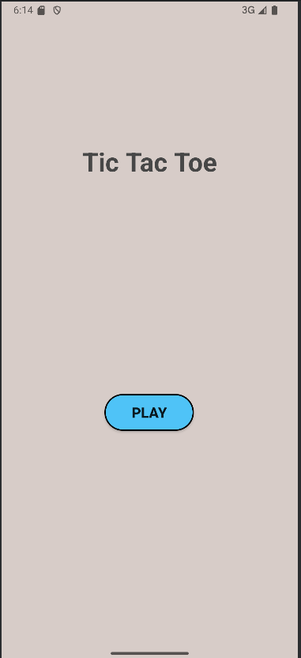
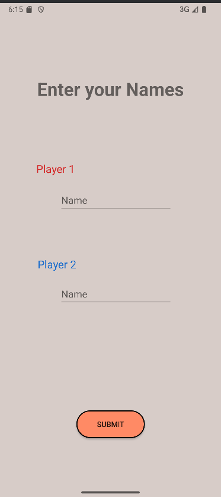
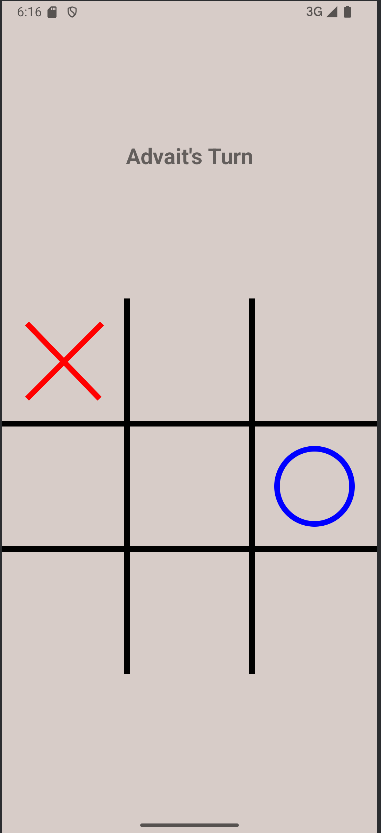
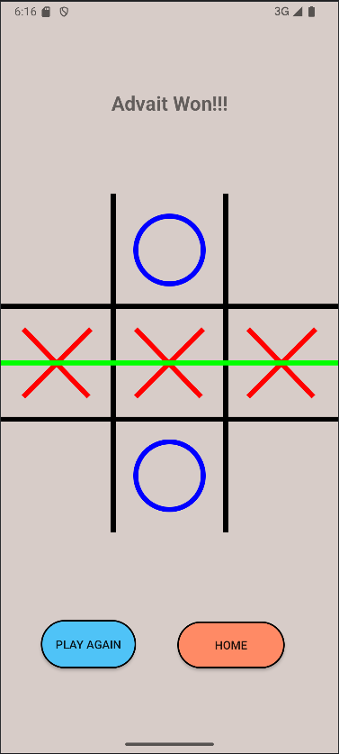

# 🎮 Tic-Tac-Toe Android Game

A simple **two-player Tic-Tac-Toe** game built in Java using Android Studio.

## ✨ Features  
- 🎮 Two-player local mode  
- 🎨 Simple and clean UI with ConstraintLayout  
- 🔄 Reset button to restart the game  
- ❌⭕ Win detection with a highlight on the winning row  

## 🚀 Installation
1. **Clone the repository**  
   ```sh
   git clone https://github.com/Advaitaflek/TicTacToe-Android.git
2. **Open the project**  
   - Launch **Android Studio**.  
   - Click on **"Open"** and select the cloned project folder.  
3. **Run the app**  
   - Connect an **Android device** (or open an emulator).  
   - Click on **Run ▶** in Android Studio.  
   - Enjoy playing Tic-Tac-Toe! 🎮
  
## 🚀 Usage  
1. **Launch the App** 📱
2. **Click on Play**
3. **Enter Player Names** ❌⭕
4. **Click on Submit**
5. **Tap on a cell** to mark your move.  
6. **Win by completing a row, column, or diagonal!** 🎉  
7. **Click "Play Again" to start a new game or "Home" to go to the Homepage** 🔄

## 📸 Screenshots  

### 🏠 Home Screen  
  

### 👤 Player Detail Screen  
  

### 🎮 Gameplay  
  

### 🎉 Win Screen  
  

## 🛠️ Tech Stack  
- **Programming Language:** Java ☕  
- **IDE:** Android Studio 🏗️  
- **UI Design:** XML 🎨  
- **Frameworks & Libraries:**  
  - **Android SDK** 📱  
  - **ConstraintLayout** 📐  
  - **Jetpack Components** 🛠️ 

## 🔮 Future Enhancements  
- 🤖 **Single Player Mode** – Add an AI opponent using the Minimax algorithm.  
- 🌍 **Multiplayer Mode (Online)** – Enable online play using Firebase or WebSockets.  
- ✨ **Animated UI Effects** – Improve user experience with smooth animations.  
- 📊 **Scoreboard & Game History** – Keep track of player scores and past games.  
- 🎨 **Custom Themes** – Allow users to switch between different board themes.  
- 🔊 **Sound Effects & Vibration** – Enhance gameplay with sound feedback and haptics.  

## 🤝 Contributing  
Contributions are welcome! 🎉  
If you’d like to improve this project, feel free to fork the repo and submit a pull request.  

## 📬 Contact  
If you have any suggestions or feedback, feel free to reach out!  
- **GitHub:** [Advaitaflek](https://github.com/Advaitaflek)  

## 🙌 Credits  
This project was inspired by the **[Tic-Tac-Toe Android Development Playlist](https://www.youtube.com/watch?v=Fa5egLurW5U&list=PLcSIMAULmMyftO2SvNGE5mmYKKeAWCJUm&index=1)** by **[Practical Coding](https://www.youtube.com/@PracticalCoding)** on YouTube.  
A huge thanks to them for their detailed tutorials! 🎥  

## 📜 License  
This project is licensed under the **MIT License**.  

You are free to use, modify, and distribute this software.  

See the [LICENSE](https://github.com/Advaitaflek/TicTacToe-Android/blob/main/LICENSE) file for more details.  
